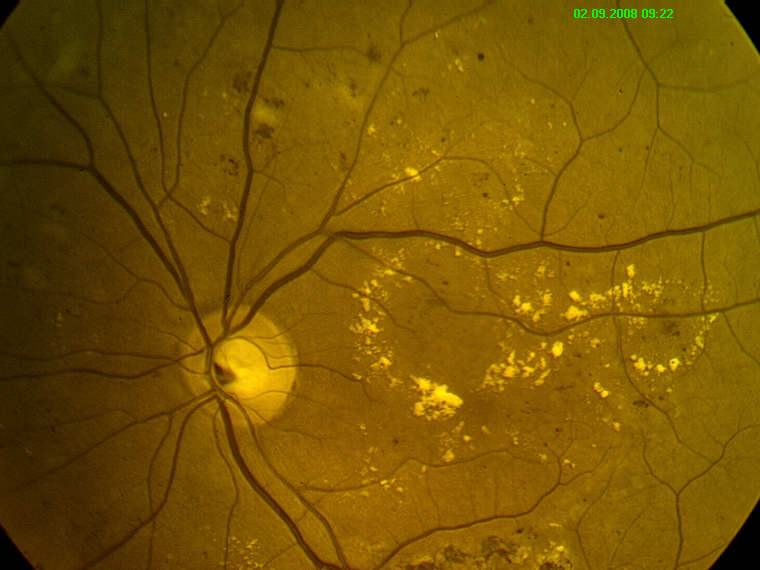

# Diabetic_Retinopathy
Link to the Paper: https://ieeexplore.ieee.org/document/9031947

# Abstract
Diabetic retinopathy disease is constantly on the rise across the globe which causes blurry vision, partial and total blindness to diabetic affected people. Advancement of Biomedical imaging with signal processing and machine learning algorithms make ease of the prediction of Diabetic retinopathy to a greater extent. In this study, the retinal image is taken from a fundus camera of both healthy and diabetic retina. Image pre-processing techniques, morphological operations are used to detect the statistical features and the histogram-based feature is extracted by using Discrete Wavelet Transform (DWT) which is the novel contribution of the proposed algorithm. These features are classified by any machine learning approach (K-Nearest Neighbors, Support Vector Machine and Artificial Neural Network) to predict DR accurately and efficiently following a cross-validation approach.

